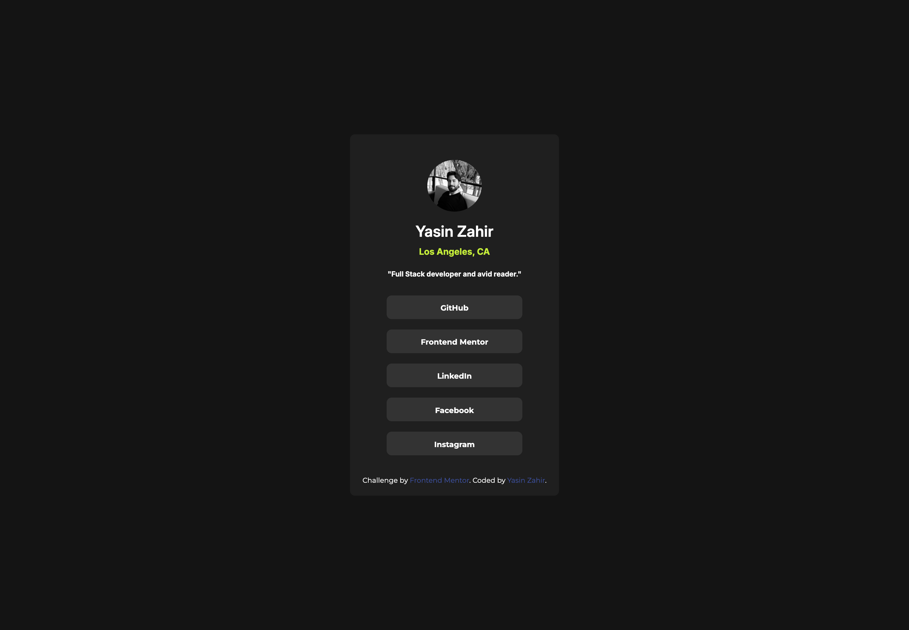

# Social Links Profile Card – Yasin Zahir

This is a Frontend Mentor challenge solution built by **Yasin Zahir**, showcasing a responsive social links profile card. It's a clean, minimalist design displaying key personal and professional links, built with semantic HTML and modern CSS.

## 🔍 Preview

 <!-- Update path as needed -->
 <!-- Update path as needed -->

## 🚀 Features

- Responsive card layout
- Minimalistic dark theme
- External links to GitHub, LinkedIn, Frontend Mentor, and more
- Semantic HTML structure
- Accessible & mobile-friendly

## 📌 Tech Stack

- HTML5  
- CSS3  
- Frontend Mentor Challenge  

## 🧠 What I Learned

While building this project, I reinforced best practices around:

- Using semantic HTML elements for accessibility
- CSS styling consistency and hierarchy
- Designing for responsiveness and visual hierarchy

## 🛠️ Setup

To run this locally:

1. Clone the repo:
   ```bash
   git clone https://github.com/YOUR-USERNAME/social-links-profile-card.git
